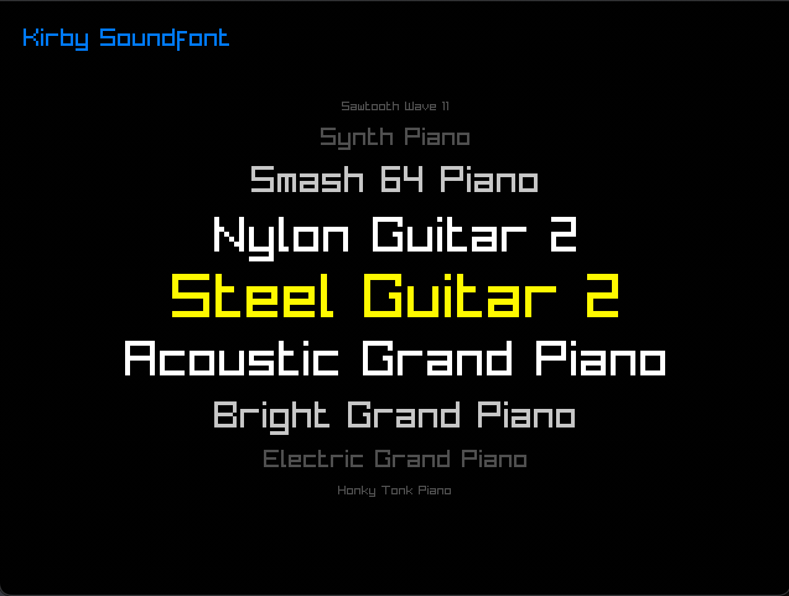

# fluiray

node-raylib frontend for fluidsynth, for handheld computers




I have a RG351V, which has sound, a gamepad, and a 640x480 screen built-in. I wanted a way to use easily use fluidsynth with soundfonts on a MIDI keyboard plugged into it.

You need to run fluidsynth:

```
fluidsynth -q -d -p fluidray -s
```

I included [an example script](fluiray.sh) that connects my midi keyboard to the synth.

- Hints for installation & usage can be found [here](system/).
- Similar project (with no UI) [here](https://lucidbeaming.com/blog/running-fluidsynth-on-a-raspberry-pi-zero-w/)
